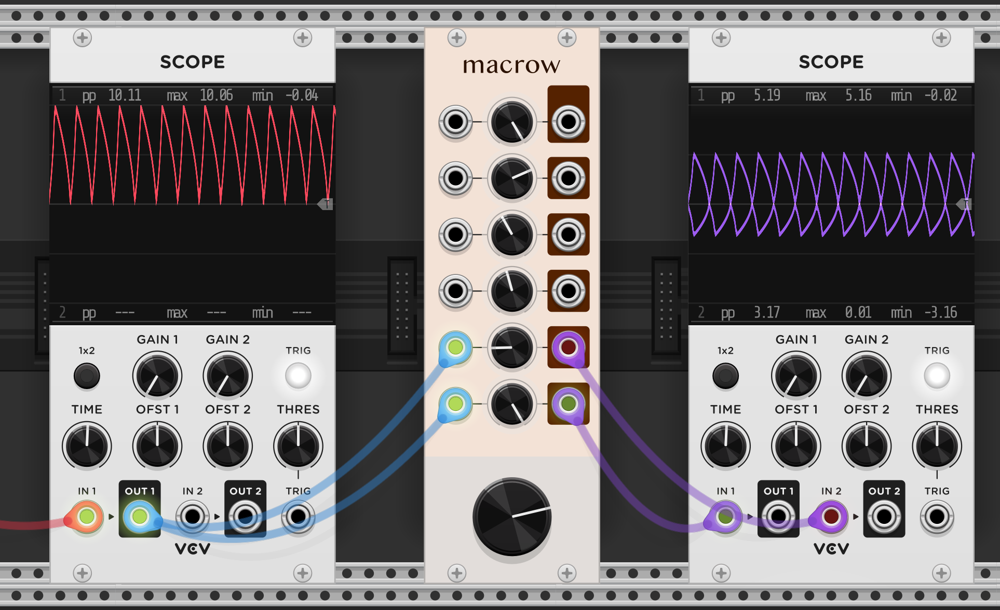
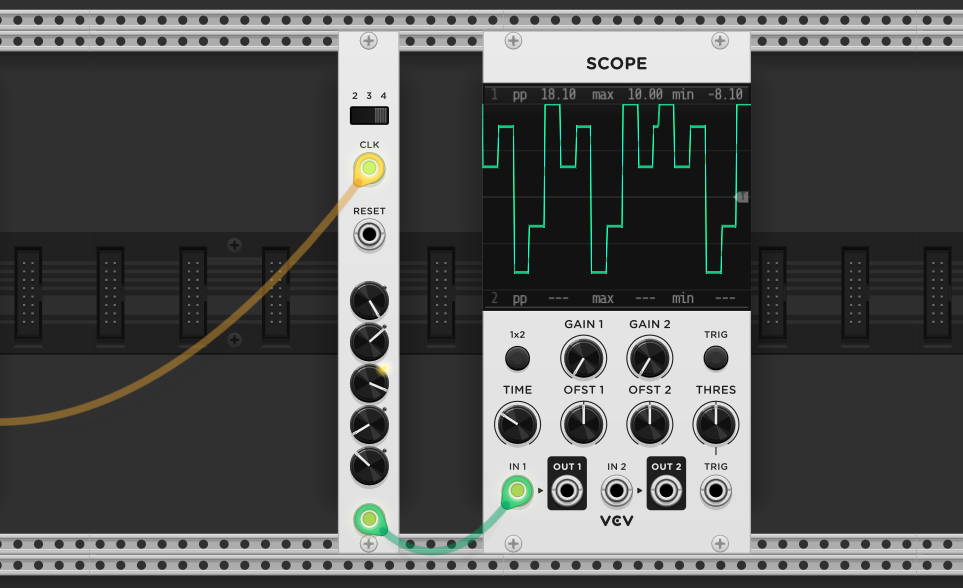

# VCV Modules

This repository contains a few utilty modules that I needed in VCV rack, enjoy! 


## Macrow
6 attenuverters with one macro knob (also an attenuverter) which controls the magnitude of all channels. A quick remix of the original 8vert VCV module for better control over many values from one knob.





### To Do

Panel design

Normalling behaviour

Macrow knob could also take CV


## FiveStep
Simple 5 step sequencer with reset and selectable length from 3 - 5.



### To Do

Panel


### Build

Install VCV SDK as per the instructions on the website

```x64``` to run the alias ```alias x64='arch -x86_64 zsh'``` since i'm on apple silicon

```make``` to compile

```make install``` to install the plugin into VCV rack